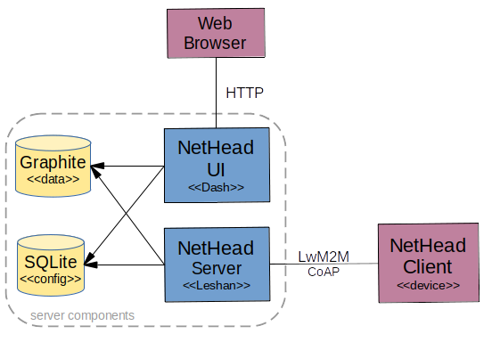

# NetHead
NetHead is a tool for embedded device data collection and display. It uses LwM2M to transfer configuration and data between the device and server. It uses SQLite for configuration storage, and Graphite for data storage. It provides a Dash/Flask based web user interface to view the configuration and data.

